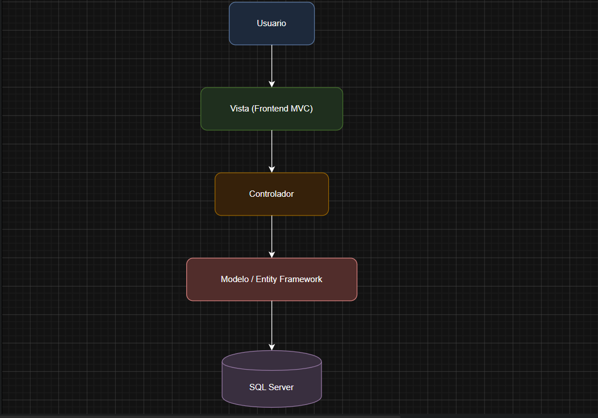

# ADR-01: Arquitectura MVC para catálogo de ropa

| Campo  | Valor |
|--------|-------|
| Autor  | Marcelo Medina |
| Fecha  | 15/05/2026 |
| Estado | `Aceptado` |

---

## Contexto

Voy a desarrollar un sistema de catálogo de ropa para pequeños vendedores y revendedores.
El objetivo del proyecto es permitir administrar productos, visualizar prendas disponibles y organizar la información de manera sencilla.
El sistema está pensado para emprendedores pequeños que necesitan mostrar su catálogo sin utilizar plataformas complejas o costosas.

El proyecto se desarrolla utilizando tecnologías vistas en clase y considerando restricciones de tiempo y experiencia técnica del equipo.

---

## Decisión

Se decidió utilizar:

Lenguaje C#
ASP.NET Core MVC
Entity Framework Core
SQL Server
Arquitectura MVC
Git y GitHub para control de versiones

### ¿Por qué?

ASP.NET Core MVC permite separar la lógica de negocio, la interfaz y el manejo de datos, haciendo el sistema más organizado y fácil de mantener.

Entity Framework Core facilita la conexión con la base de datos y reduce la cantidad de consultas SQL manuales.

SQL Server fue elegido por su integración sencilla con .NET y porque es adecuado para proyectos pequeños y medianos.

GitHub permitirá mantener un historial de cambios y facilitar el trabajo colaborativo.

### Alternativas consideradas

| Alternativa | Por qué la descarté |
|-------------|---------------------|
| Aplicación de consola       | No ofrece una interfaz visual adecuada para un catálogo              |
|  Windows Forms        |  Tiene menos flexibilidad y escalabilidad para aplicaciones web                |
| PHP con MySQL         | Requería aprender herramientas fuera del entorno trabajado en clase                 |

---

## Consecuencias

**✅ Lo que gano:**

-Mejor organización del proyecto
-Separación clara entre vistas, lógica y datos
-Facilidad para agregar nuevas funciones como filtros, categorías o imágenes
-Mayor facilidad de mantenimiento y escalabilidad

**⚠️ Lo que sacrifico o asumo:**

-Mayor complejidad inicial comparada con proyectos simples
-Necesidad de configurar base de datos y migraciones
-Si el sistema crece demasiado, podría requerir una arquitectura más avanzada

## Diagrama

